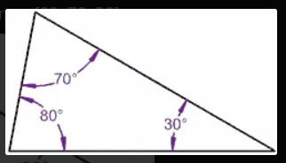
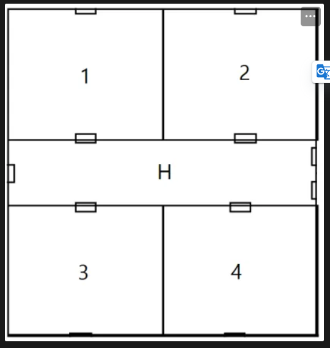
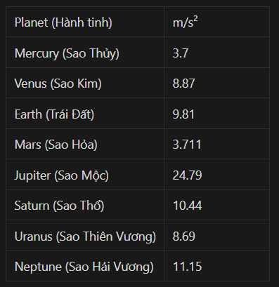

# JAVASCRIPT CƠ BẢN PHẦN 3

### Câu 01. Kiểm tra số nguyên dương.

Đề bài: Theo lý thuyết thì số nguyên dương là tập hợp những số chia hết cho 1 và lớn hơn 0. Tức là dãy số 1, 2, 3 ,4 ,5 ,6 ... chính là các số nguyên dương.

-   Dùng hàm prompt để tạo ô nhập và lấy ra giá trị từ ô nhập đó.
-   Viết một hàm kiểm tra số nhập vào có phải số nguyên dương hay không?
    -   Nếu đúng alert ra YES.
    -   Nếu sai alert ra NO.

### Câu 02: Kiểm tra có phải là một hình?

Đề bài: Một hình gồm n cạnh và n góc. Nhập vào số n và một mảng gồm n phần tử chứa các góc (độ) của một hình (hình tam giác, hình vuông,…).

-   Ví dụ:
    -   Hình tam giá có 3 cạnh, và các góc lần lượt là 80°, 70° và 30°.
    -   Vậy ta có n = 3 và array=[80, 70, 30]
    

-   Cho người dùng nhập vào n và một mảng gồm n phần tử là các góc. Viết một hàm kiểm tra xem từ số n và mảng đó có thỏa mãn là một hình vẽ hay không?
    -   Nếu thỏa mãn trả ra **true**
    -   Nếu không thỏa mãn trả ra **false**

-   Lưu ý:
    -   Trả về **false** nếu **n < 3**.
    -   Tổng các góc trong là **(n - 2) x 180°**.

**VÍ DỤ**
```javascript
n = 4 và array = [90, 90, 90, 90] —> true

n = 3 và array = [20, 20, 140] —> true

n = 1 và array = [21] —> false
// vì n phải lớn hơn 2

n = 5 và array = [500, 0, 20, 10, 10] —> false
// vì tổng các góc không thể lớn hơn 180° và cũng không có góc nào nhỏ hơn hoặc bằng 0°.
```

### Câu 03: Viết tắt câu

Đề bài: Tạo một hàm nhận vào một câu văn và trả về chữ viết tắt của câu văn đó. Lấy tất cả các từ có độ dài lớn hơn hoặc bằng n ký tự và trả về chữ cái đầu tiên của mỗi từ, được viết hoa.

**VÍ DỤ**
```javascript
abbreviate("Xin chào! Tôi tên là Nam.") —> "XCTTLN"

abbreviate("Xin chào! Tôi tên là Nam.", 3) —> "XCTTN"
// Chữ "là" bị bỏ qua, vì có 2 ký tự, nhỏ hơn n = 3

abbreviate("Xin chào! Tôi tên là Nam.", 4) —> "CN"
// Các chữ có 3 ký tự trở xuống bị bỏ, vì n = 4
```

### Câu 04: AlTeRnAtInG cApS (Thay đổi viết hoa, viết thường)

Đề bài: Tạo một hàm thay đổi kiểu viết (hoa hoặc thường) của các chữ cái trong một chuỗi.

-   Viết xen kẽ 1 chữ hoa xong đến 1 chữ thường, lặp đi lặp lại cho đến hết chuỗi.
-   Lưu ý:
    -   Ký tự đầu tiên phải luôn luôn là HOA.
    -   Bỏ qua khoảng trắng.

**VÍ DỤ**
```javascript
"Khá Bảnh" —> "KhÁ bẢnH"

"Khổ trước sướng sau thế mới giàu." —> "KhỔ tRưỚc SưỚnG sAu ThẾ mỚi GiÀu."

"Giàu trước khổ sau thế càng đau." —> "GiÀu TrƯớC kHổ SaU tHế CàNg ĐaU."
```

### Câu 05: Thống kê cơ bản: Trung vị

Đề bài: 
    -   Trung vị của một nhóm số là số ở giữa khi nhóm được sắp xếp.

    -   Nếu kích thước của nhóm là chẵn, trung vị là trung bình cộng của hai số ở giữa.

    -   Cho một dãy số đã sắp xếp, trả về giá trị trung bình (được làm tròn đến một chữ số thập phân nếu giá trị trung bình không phải là số nguyên).

**VÍ DỤ**
```javascript
[1, 2, 4, 5, 6, 8, 8, 8, 10] —> 6

[2, 2, 6, 8, 8, 10, 10] —> 8

[1, 2, 2, 4, 7, 8, 9, 10] —> 5.5
```

### Câu 06: Bánh sinh nhật

- Đề bài:
    -   Viết một hàm **getBirthdayCake(name, age)** để tạo một chiếc bánh sinh nhật hình chữ nhật, dựa trên tên và tuổi của ai đó.
    -   Nếu tuổi là một số chẵn, hãy vẽ hình bao quanh bằng chữ "#".
    -   Nếu tuổi là một số lẻ, hãy vẽ hình bao quanh bằng chữ "*".
    -   Dòng tin nhắn phải ở định dạng: {tuổi} Chúc mừng sinh nhật {tên}! {tuổi}
    -   Để lại một khoảng trống giữa mép bánh và số tuổi.

**VÍ DỤ**
```javascript
const test1 = getBirthdayCake("Nam", 18);
console.log(test1);
/*
  ##################################
  # 18 Chúc mừng sinh nhật Nam! 18 #
  ##################################
*/

const test2 = getBirthdayCake("Long", 17);
console.log(test2);
/*
  ***********************************
  * 17 Chúc mừng sinh nhật Long! 17 *
  ***********************************
*/
```


### Câu 07: Blah, Blah, Blah…

Đề bài: 
    -   Tạo một hàm thay thế **n** từ cuối cùng bằng "blah". Thêm "..." vào "blah" cuối cùng.
    -   Nếu **n** dài hơn số từ trong câu, hãy thay tất cả các từ bằng "blah"
    -   Tất cả các từ "blah" sẽ là chữ thường!

**VÍ DỤ**
```javascript
blahBlah("Anh học CNTT hả, cài win dùm em nhé!", 3)
—> "Anh học CNTT hả, cài win blah blah blah…"

blahBlah("Cảm giác bất an khi tự dưng một đứa bạn cũ hỏi mình đang học IT phải không.", 5)
—> "Cảm giác bất an khi tự dưng một đứa bạn cũ hỏi mình blah blah blah blah blah…"
```

### Câu 08: Tính tổng đơn hàng

Đề bài: Tạo một hàm truyền vào một array gồm các phần tử là object (gồm các key: product, quantity, price) để tính toán tổng giá và trả về dưới dạng một số.

**VÍ DỤ**
```javascript
const test1 = getTotalPrice([
	{ product: "Sữa", quantity: 1, price: 7000 }
]);
console.log(test1); // 7000

const test2 = getTotalPrice([
    { product: "Sữa", quantity: 1, price: 7000 },
    { product: "Ngũ cốc", quantity: 1, price: 50000 },
]);
console.log(test2); // 57000

const test3 = getTotalPrice([
    { product: "Sữa", quantity: 3, price: 7000 }
]);
console.log(test3); // 21000

const test4 = getTotalPrice([
    { product: "Sữa", quantity: 1, price: 7000 },
    { product: "Trứng", quantity: 12, price: 3000 },
    { product: "Bánh mỳ", quantity: 2, price: 15000 },
    { product: "Phô mai", quantity: 1, price: 5000 },
]);
console.log(test4); // 78000

const test5 = getTotalPrice([
    { product: "Sô cô la", quantity: 1, price: 12000 },
    { product: "Kẹo", quantity: 1, price: 2000 },
]);
console.log(test5); // 14000
```

### Câu 09: Viết hoa chữ cái đầu tiên của mỗi từ

Đề bài: Tạo một hàm và truyền vào một chuỗi. Sau đó chuyển đổi ký tự đầu tiên của mỗi từ trong chuỗi đó thành chữ hoa. Trả về chuỗi vừa được định dạng.

**VÍ DỤ**
```javascript
makeTitle("Fix bug là chuyện dễ. Tìm đoạn code gây ra bug để fix mới là chuyện khó.")
—> "Fix Bug Là Chuyện Dễ. Tìm Đoạn Code Gây Ra Bug Để Fix Mới Là Chuyện Khó."


makeTitle("Khi tui biên dịch và code chạy suôn sẻ trong lần đầu. Tui tự hỏi đã làm sai chỗ nào.")
—> "Khi Tui Biên Dịch Và Code Chạy Suôn Sẻ Trong Lần Đầu. Tui Tự Hỏi Đã Làm Sai Chỗ Nào."
```

### Câu 10: Chọn cầu chì

Đề bài: 
    -   Cầu chì bị đứt mạch điện khi dòng điện đi qua vượt quá định mức của cầu chì, để ngăn không cho nhiệt tích tụ quá nhiều (có thể gây cháy). Cầu chì lý tưởng để chọn cao hơn đầu ra hiện tại của thiết bị, nhưng cũng càng gần với nó càng tốt.
    -   Đưa ra một danh sách các loại cầu chì và đầu ra hiện tại của thiết bị, hãy trả về cầu chì nào là tốt nhất cho thiết bị.

**VÍ DỤ**
```javascript
Danh sách cầu chì "3V", "5V", "12V" và thiết bị "4.5V" —> "5V"

Danh sách cầu chì "5V", "14V", "2V" và thiết bị "5.5V" —> "14V"

Danh sách cầu chì "17V", "15V", "12V" và thiết bị "9V" —> "12V" 
```

### Câu 11: Đếm số lượng số "1" trong mảng 2D

Đề bài: Tạo hàm đếm số lượng số "1" trong mảng 2D.

**VÍ DỤ**
```javascript
const test1 = countOnes([
    [1, 0],
    [0, 0],
]);
console.log(test1); // 1

const test2 = countOnes([
    [1, 1, 1],
    [0, 0, 1],
    [1, 1, 1],
]);
console.log(test2); // 7

const test3 = countOnes([
    [1, 2, 3],
    [0, 2, 1],
    [5, 7, 33],
]);
console.log(test3); // 2
```

### Câu 12: Swap Cases (Đảo ngược viết hoa, viết thường)

Đề bài: Viết hàm swappingCases(string) truyền vào một string bất kỳ, đảo ngược cách viết hoa, viết thường của các chữ cái.

**Ví dụ**
```javascript
"Le VAn HunG" —> "lE vaN hUNg"

"Đặng PhưƠnG NAm" —> "đẶNG pHƯơNg naM"
```

### Câu 13: Inverted Numbers (Đảo ngược giá trị của số)

- Đề bài: Viêt hàm invertedNumbers(array) truyền vào một mảng có các phần tử là các số bất kỳ, hãy đảo ngược giá trị từ âm sang dương, hoặc từ dương sang âm của các số trong mảng đó.

**VÍ DỤ**
```javascript
[1, -10, -20, 15, 100, -30] —> [-1, 10, 20, -15, -100, 30]

[-20, 30, 10, -25, -60, 20] —> [20, -30, -10, 25, 60, -20]
```

### Câu 14: Ignore Number Value (Bỏ qua các chữ số)

Đề bài: Viết hàm ignoreNumbers(string) truyền vào một string bao gồm cả số và chữ, hãy trả về một string mới chỉ gồm chữ.

**VÍ DỤ**
```javascript
"Test4Ag54SF" —> "TestAgSF"

"JHk34Gl3gG" —> "JHkGlgG"
```

### Câu 15: Tìm từ ≤ n ký tự

Đề bài: Viết hàm smallWords(string, number) truyền vào một string và một số number. Trả ra một string mới chỉ gồm những từ ≤ number.

**VÍ DỤ**
```javascript
smallWords("I Love Foood Code Too Playing Much", 4) —> "I Love Code Too Much".

smallWords("I Love Foood Code Too Playing Much", 3) —> "I Too"
```

### Câu 16: Tìm số trong String và Nhân

Đề bài: Viết hàm multiplyNumberInString(string), truyền vào một string, hãy trả ra một string mới là phép nhân của các số có trong string đó.

**VÍ DỤ**
```javascript
    "JG23BGH5BA" —> "4925"
        -   2*2 = 4
        -   3*3 = 9
        -   5*5 = 25
        -   —> "4925"

    "VD23GS8S6AH" —> "496436"
        -   2*2 = 4
        -   3*3 = 9
        -   8*8 = 64
        -   6*6 = 36
        -   —> "496436"

    "AGD353GDSK8" —> "925964"
        -   3*3 = 9
        -   5*5 = 25
        -   3*3 = 9
        -   8*8 = 64
        -   —> "925964"

    "JBKJJKLDJ" —> "0"
        -   Do không có số nào.
```

### Câu 17: Tính tổng tiền trong giỏ hàng

Đề bài: Cho một mảng giỏ hàng chứa các sản phẩm (bao gồm tên, giá, số lượng). Hãy tính tổng tiền của giỏ hàng đó.

**VÍ DỤ**
```javascript
const cart = [
  { name: "iPhone", price: 1000, quantity: 5 },
  { name: "iPad", price: 500, quantity: 2 },
  { name: "MacBook", price: 2000, quantity: 1 },
];

// Tính toán để trả về: 1000 * 5 + 500 * 2 + 2000 * 1 = 8000
```

### Câu 18: Nhóm các học sinh trong một lớp theo giới tính

Đề bài: Cho một mảng danh sách các học sinh của một lớp. Hãy nhóm các học sinh Nam thành 1 nhóm, học sinh Nữ thành 1 nhóm.

**VÍ DỤ**
```javascript
const students = [
    { hoTen: "Le Van A", gioiTinh: "Nam" },
    { hoTen: "Do Van B", gioiTinh: "Nam" },
    { hoTen: "Nguyen Thi C", gioiTinh: "Nu" },
    { hoTen: "Dao Van D", gioiTinh: "Nam" },
    { hoTen: "Hoang Thi E", gioiTinh: "Nu" },
    { hoTen: "Vu Van F", gioiTinh: "Nam" },
];

/*
Trả về:
{
  "Nam": [
      "Le Van A",
      "Do Van B",
      "Dao Van D",
      "Vu Van F"
  ],
  "Nu": [
      "Nguyen Thi C",
      "Hoang Thi E"
  ]
}
*/
```

### Câu 19: Tính tổng theo từng nhóm trong một mảng

Đề bài: Cho một mảng gồm các phần tử là các mảng con. Hãy tính tổng giá trị của các phần tử trong mảng con.

**VÍ DỤ**
```javascript
const numbers = [
    [1, 2],
    [3, 4],
    [5, 6],
];

/*
Trả về:
[3, 7, 11];
*/
```

### Câu 20: Tính tổng điểm theo từng lớp

Đề bài: Cho một mảng gồm các học sinh (bao gồm các thông tin: họ tên, lớp, điểm trung bình của học sinh đó). Hãy tính tổng điểm theo từng lớp.

**VÍ DỤ**
```javascript
const students = [
    { hoTen: "Le Van A", lop: "A", diem: 7.5 },
    { hoTen: "Do Van B", lop: "B", diem: 6.8 },
    { hoTen: "Nguyen Thi C", lop: "A", diem: 8 },
    { hoTen: "Dao Van D", lop: "C", diem: 9 },
    { hoTen: "Hoang Thi E", lop: "B", diem: 8.5 },
    { hoTen: "Vu Van F", lop: "B", diem: 7.2 },
];

/*
Trả về:
{
  A: 15.5,
  B: 22.5,
  C: 9
}
*/
```

### Câu 21: Tổng Thể Tích của Tất Cả Các Hộp

Đề bài:
-   Cho một mảng các hộp, tạo một hàm trả về tổng thể tích của tất cả các hộp đó.

-   Một hộp được biểu diễn bằng một mảng gồm ba phần tử: chiều dài, chiều rộng và chiều cao.

-   Ví dụ, **totalVolume([2, 3, 2], [6, 6, 7], [1, 2, 1])** sẽ trả về **266** vì (2 x 3 x 2) + (6 x 6 x 7) + (1 x 2 x 1) = 12 + 252 + 2 = 266.


**VÍ DỤ**
```javascript
totalVolume([4, 2, 4], [3, 3, 3], [1, 1, 2], [2, 1, 1]) ➞ 63

totalVolume([2, 2, 2], [2, 1, 1]) ➞ 10

totalVolume([1, 1, 1]) ➞ 1
```

**CHÚ Ý** 
    -   Nhập ít nhất 1 hộp.
    -   Mỗi hộp luôn có ba chiều: chiều dài, chiều rộng và chiều cao.

### Câu 22: Tìm Giá Trị Trung Bình của Tất Cả Các Chữ Số

Đề bài: Tạo một hàm trả về giá trị trung bình của tất cả các chữ số.

**VÍ DỤ**
```javascript
mean(42) ➞ 3

mean(12345) ➞ 3

mean(666) ➞ 6
```

**Lưu ý:** 
```
    -   Giá trị trung bình sẽ luôn được làm tròn thành số nguyên (Và làm tròn xuống).
    -   Giá trị trung bình của tất cả các chữ số là **tổng của các chữ số/số lượng chữ số.**
    -   Ví dụ: giá trị trung bình của các chữ số 512 là (5+1+2)/3 = 8/3 = 2.
```

### Câu 23: H4ck3r Sp34k (Chuyển đổi thành ngôn ngữ Hacker)

Đề bài: Tạo một hàm nhận một chuỗi là đối số và trả về phiên bản được mã hóa (h4ck3r 5p34k) của chuỗi đó.

**VÍ DỤ**
```javascript
hackerSpeak("javascript is cool") ➞ "j4v45cr1pt 15 c00l"

hackerSpeak("programming is fun") ➞ "pr0gr4mm1ng 15 fun"

hackerSpeak("become a coder") ➞ "b3c0m3 4 c0d3r"
```

**Lưu ý:** 
```
    - Hàm này phải thay thế tất cả các ký tự:
        -   **a** thay bằng **4**
        -   **e** thay bằng **3**
        -   **i** thay bằng **1**
        -   **o** thay bằng **0**
        -   **s** thay bằng **5**
```

### Câu 24: Phạm vi mảng

- Đề bài: Viết một hàm nhận vào hai giá trị bắt đầu (startNum) và kết thúc (endNum), và trả về một mảng chứa tất cả các số trong khoảng đó, bao gồm cả hai giá trị bắt đầu và kết thúc.

**Ví dụ:**
```javascript
inclusiveArray(1, 5) ➞ [1, 2, 3, 4, 5]

inclusiveArray(2, 8) ➞ [2, 3, 4, 5, 6, 7, 8]

inclusiveArray(10, 20) ➞ [10, 11, 12, 13, 14, 15, 16, 17, 18, 19, 20]

inclusiveArray(17, 5) ➞ [17]
```

**GHI CHÚ** Các số trong mảng được sắp xếp theo thứ tự tăng dần.

### Câu 25: Tách mã mặt hàng

- Đề bài: Viết một hàm nhận một mã hàng hóa và trả về một mảng chứa phần chữ cái và phần số tương ứng của mã đó. Mã hàng hóa có định dạng "[chữ cái][chữ số]".

**Ví dụ:**
```javascript
splitCode("TEWA8392") ➞ ["TEWA", 8392]

splitCode("MMU778") ➞ ["MMU", 778]

splitCode("SRPE5532") ➞ ["SRPE", 5532]
```

### Câu 26: Chạy Marathon 25 Dặm

- Đề bài: 
    -   Mary muốn tham gia một cuộc marathon 25 dặm. Khi cô đăng ký tham gia marathon, cô nhận thấy tờ đăng ký không trực tiếp nêu chiều dài của marathon. Thay vào đó, chiều dài của marathon được liệt kê thành từng phần nhỏ, khác nhau. Hãy giúp Mary tìm ra chiều dài thực sự của cuộc marathon.

    -   Trả về true nếu marathon có chiều dài là 25 dặm, nếu không, trả về false.

**Ví dụ:**
```javascript
marathonDistance([1, 2, 3, 4]) ➞ false

marathonDistance([1, 9, 5, 8, 2]) ➞ true

marathonDistance([-6, 15, 4]) ➞ true

marathonDistance([]) ➞ false

marathonDistance() ➞ false
```

**Ghi chú**:
    -   Các phần tử trong mảng sẽ luôn là số nguyên.
    -   Các phần tử trong mảng có thể là số âm hoặc dương, nhưng vì khoảng cách âm không thể xảy ra, hãy tìm cách chuyển các số nguyên âm thành số nguyên dương.
    -   Trả về false nếu các đối số là mảng rỗng hoặc không chuyền vào mảng.

### Câu 27: Vấn đề nhân viên bán hàng du lịch

- Đề bài:
    -   Một nhà du lịch có một số lượng thành phố để thăm. Anh ấy muốn tính toán tổng số lượng con đường có thể anh ấy đi qua, thăm mỗi thành phố một lần trước khi trở về nhà. Trả về tổng số lượng con đường có thể một nhà du lịch có thể đi qua, với n thành phố.

**Nếu chúng ta có các thành phố A, B và C, các con đường có thể là:**
```javascript
A -> B -> C
A -> C -> B
B -> A -> C
B -> C -> A
C -> B -> A
C -> A -> B
... cung cấp 6 đường dẫn có thể đi.
```

**Ví dụ**
```javascript
paths(4) ➞ 24

paths(1) ➞ 1

paths(9) ➞ 362880
```

### Câu 28: Cường độ nổ

- Đề bài:
    -   Cho một số nguyên, trả về một chuỗi từ "Boom", có các biến thể như sau:
    -   Chuỗi phải bao gồm n ký tự "o", trừ khi n nhỏ hơn 2 (trong trường hợp đó, trả về "boom").
    -   Nếu n chia hết cho 2, thêm dấu chấm than (!) vào cuối.
    -   Nếu n chia hết cho 5, trả về chuỗi IN HOA.
    -   Nếu n chia hết cho cả 2 và 5, trả về chuỗi IN HOA và thêm dấu chấm than vào cuối.

**Ví dụ:**
```javascript
boomIntensity(4) ➞ "Boooom!"
// Có 4 ký tự "o" và 4 chia hết cho 2 (bao gồm dấu chấm than)

boomIntensity(1) ➞ "boom"
// 1 nhỏ hơn 2, nên trả về "boom"

boomIntensity(5) ➞ "BOOOOOM"
// Có 5 ký tự "o" và 5 chia hết cho 5 (IN HOA)

boomIntensity(10) ➞ "BOOOOOOOOOOM!"
// Có 10 ký tự "o" và 10 chia hết cho 2 và 5 (IN HOA và bao gồm dấu chấm than)
```

**Ghi chú**: Chuỗi "Boom" sẽ luôn bắt đầu bằng ký tự "B" in hoa, trừ khi n nhỏ hơn 2, trong trường hợp đó trả về một vụ nổ nhỏ như "boom".

### Câu 29: Giám sát hội trường

- Đề bài:
    -   Một bản đồ sàn nhà được sắp xếp như sau:
        -   Bốn phòng, tất cả đều dẫn vào hành lang.
        -   Không thể di chuyển giữa các phòng mà không vào hành lang trước.
    
    -   Tạo một hàm kiểm tra xem lối đi giữa các phòng có khả thi hay không. Hành lang sẽ được biểu diễn bằng ký tự 'H'.
**Ví dụ:**
```javascript
possiblePath([1, "H", 2, "H", 3, "H", 4]) ➞ true

possiblePath(["H", 3, "H"]) ➞ true

possiblePath([1, 2, "H", 3]) ➞ false
```

**Ghi chú:**
```javascript
    -   Một tuyến đường có thể bắt đầu hoặc kết thúc ở hành lang.
    -   Tất cả các đầu vào đều là số từ 1 đến 4 hoặc chữ cái "H".
    -   Không có phòng nào bị lặp lại.
```

### Câu 30: Bộ chuyển đổi trọng lượng hành tinh

- Đề bài:
    -   Trong thử thách này, bạn cần chuyển đổi một trọng lượng đo trên một hành tinh của Hệ Mặt Trời sang trọng lượng tương ứng trên một hành tinh khác.
    -   Trọng lượng trên hành tinh B = Trọng lượng trên hành tinh A / lực hấp dẫn của hành tinh A * lực hấp dẫn của hành tinh B

    

**Ví dụ:**
```javascript
spaceWeights("Earth", 1, "Mars") ➞ 0.37828746177370026

spaceWeights("Earth", 1, "Jupiter") ➞ 2.527013251783894

spaceWeights("Earth", 1, "Neptune") ➞ 1.1365953109072375
```